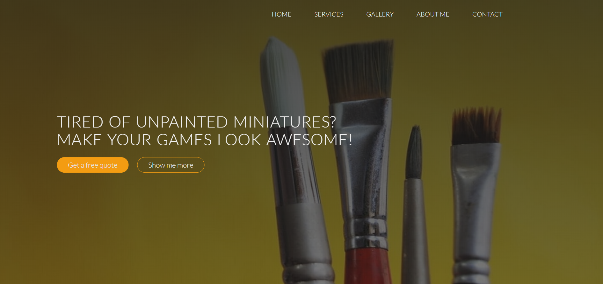

# My portfolio

That is the first "real" website that I made right after I learned about HTML and CSS.
It was ment to be a portfolio website for my painting studio.
You can find any information in case you would like to hire me as a commision painter.
There is a gallery section which introduce you to some of my work (with links to full gallery on flickr) as well as FAQ and contact section.

In order to see a demo visit [this link](https://tompod92.github.io/Painting-Studio-Website/)

